# DIOUBATE SIEM

**Détection et blocage automatique des menaces pour serveurs Windows et Linux, gratuitement.**

Un **central** (console web) et des **agents** légers installés sur vos serveurs. Les agents lisent les journaux (SSH, sudo, observateur d'événements Windows, IIS, nginx/Apache, pare-feu…) et envoient les événements au central. Le central les corrèle, lève des incidents et **bannit automatiquement** les IP hostiles sur **tous** les serveurs.

> Gratuiciel : programmes et documentation seulement. Le code source n'est pas publié.
> Auteur : **Dioubate Cheick**, Conakry (Guinée). Contact : cheickdioubate2@gmail.com

## ⬇️ Télécharger l'application

**➡️ [Télécharger la dernière version (Releases)](../../releases/latest)**

| Votre serveur | Fichier à prendre |
|---|---|
| **Windows Server** | `dioubate-siem-v0.4.1-windows-amd64.zip` |
| **Linux** | `dioubate-siem-v0.4.1-linux-amd64.tar.gz` |

> ⚠️ Les programmes sont dans les **Releases**, pas dans le bouton vert « Code ». Après téléchargement, décompressez l'archive : le dossier **`dist/`** contient les installateurs. Ne prenez pas « Source code », qui ne contient que la documentation.


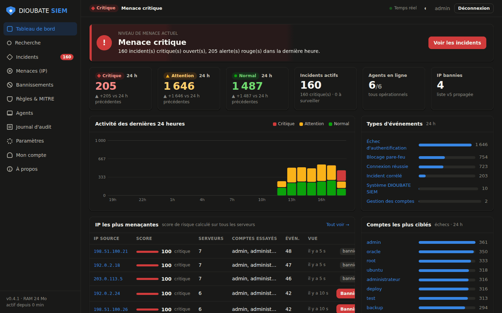
<sub>Capture prise en environnement de test, avec du trafic simulé. Les IP (192.0.2.x, 198.51.100.x, 203.0.113.x) sont des adresses réservées à la documentation (RFC 5737).</sub>

## Téléchargement

➡️ **[Dernière version (Releases)](../../releases/latest)**

| Fichier | Pour qui |
|---|---|
| `dioubate-siem-v0.4.1-windows-amd64.zip` | **Paquet Windows** : central Windows, agents Windows et Linux, guide, rapport |
| `dioubate-siem-v0.4.1-linux-amd64.tar.gz` | **Paquet Linux** : central Linux, agents, script d'installation, guide, rapport |
| `dioubate-siem-server-*` / `dioubate-siem-agent-*` | Programmes seuls (central / agent) |
| `manifest.json` | Manifeste de mise à jour **signé Ed25519** |
| `SHA256SUMS.txt` | Empreintes SHA-256 de tous les fichiers |

**Vérifiez toujours les empreintes :**

```bash
sha256sum -c --ignore-missing SHA256SUMS.txt          # Linux
Get-FileHash .\dioubate-siem-v0.4.1-windows-amd64.zip -Algorithm SHA256   # Windows (PowerShell)
```

Les archives « Source code » ajoutées automatiquement par GitHub à chaque version ne contiennent que ce dépôt (documentation). Elles ne contiennent pas de code.

## Démarrage rapide

**Central sous Linux (Ubuntu/Debian)** :

```bash
tar xzf dioubate-siem-v0.4.1-linux-amd64.tar.gz && cd dioubate-siem-v0.4.1-linux
```

```bash
sudo ./scripts/install-server.sh                      # mode local (console par tunnel SSH)
sudo ./scripts/install-server.sh --public --agents 192.168.1.0/24   # mode réseau
```

**Central sous Windows Server** : décompressez `dioubate-siem-v0.4.1-windows-amd64.zip`, puis dans une invite Administrateur, depuis le dossier `dist` :

```bat
dioubate-siem-server-windows-amd64.exe install -allow 192.168.1.0/24 -agent-allow 192.168.1.0/24
```

Ouvrez ensuite la console, changez le mot de passe initial et activez la double authentification. La page **Agents** affiche la commande d'installation prête à copier pour Windows et Linux.

📘 Guide complet illustré : **[docs/GUIDE-INSTALLATION.pdf](docs/GUIDE-INSTALLATION.pdf)**

## Fonctionnalités

- **Détection** : force brute et password spraying (SSH, RDP, Kerberos, web), comptes créés ou modifiés, élévation de privilèges, désactivation de Defender, vidage des journaux, attaques web, modification de fichiers sensibles. Règles classées **MITRE ATT&CK**.
- **Corrélation** : incidents regroupés par IP et par règle, avec un score de risque par IP calculé sur l'ensemble des serveurs.
- **Blocage** : bannissement manuel ou automatique par IP, sous-réseau, opérateur (ASN) ou pays, appliqué sur tous les agents en environ 10 s.
- **Géolocalisation** hors ligne (pays, opérateur), sans service externe.
- **Recherche** dans les journaux avec filtres (`ip:`, `sev:`, `user:`, `rule:`…), facettes et histogramme.
- **Notifications** par e-mail et Slack.
- **Zéro perte d'événement** : tampon disque sur l'agent, accusé de réception avant suppression, agrégation comptée des rafales.

## Captures de toutes les pages

<sub>Environnement de test avec trafic simulé. Les IP sont des adresses de documentation (RFC 5737).</sub>

| | |
|---|---|
| **Tableau de bord**<br> | **Recherche**<br>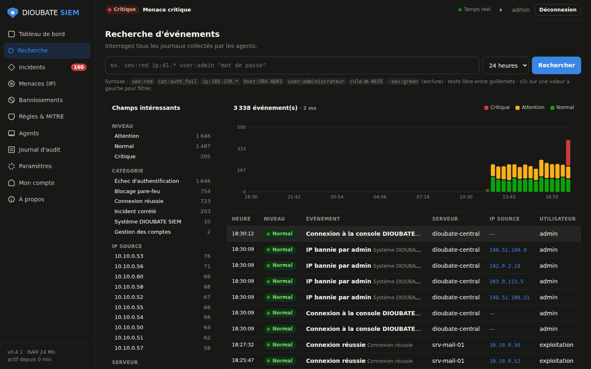 |
| **Incidents**<br>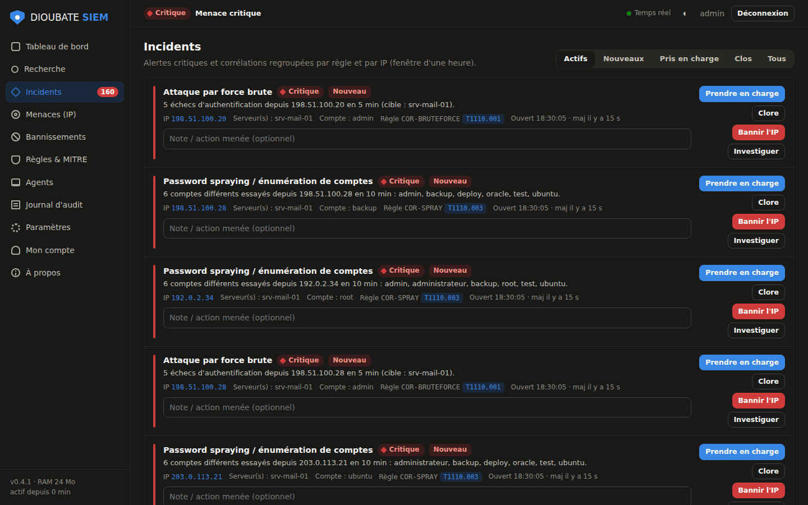 | **Menaces par IP**<br>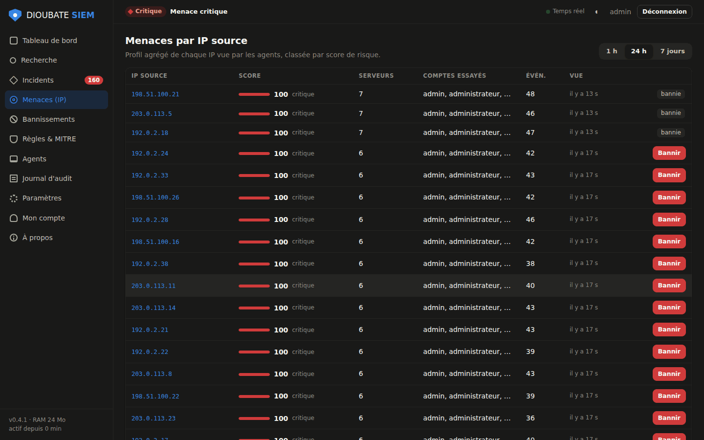 |
| **Fiche d'une IP**<br>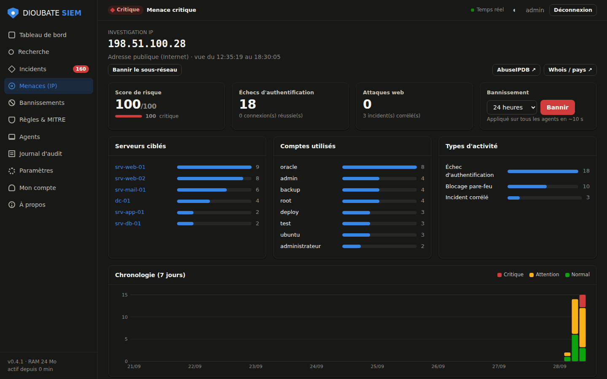 | **Bannissements**<br>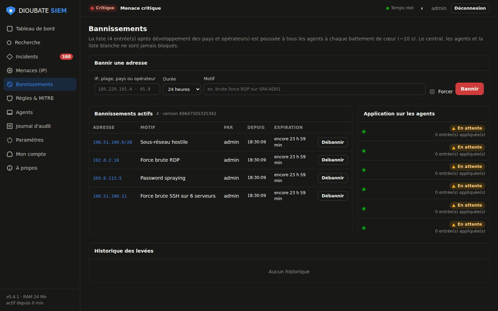 |
| **Règles & MITRE ATT&CK**<br>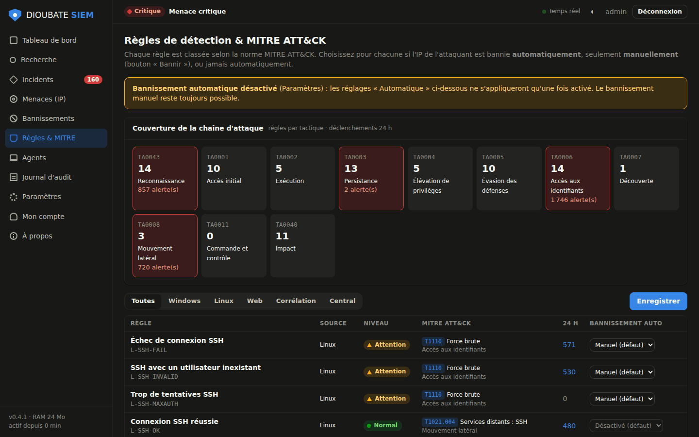 | **Agents**<br>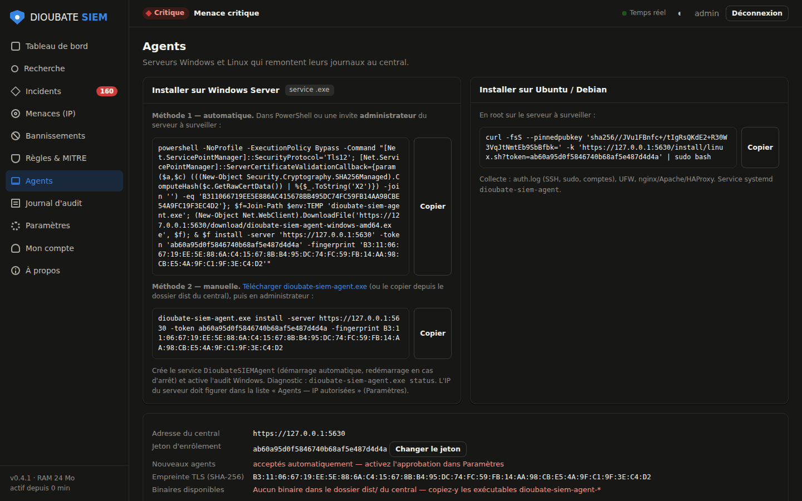 |
| **Journal d'audit scellé**<br>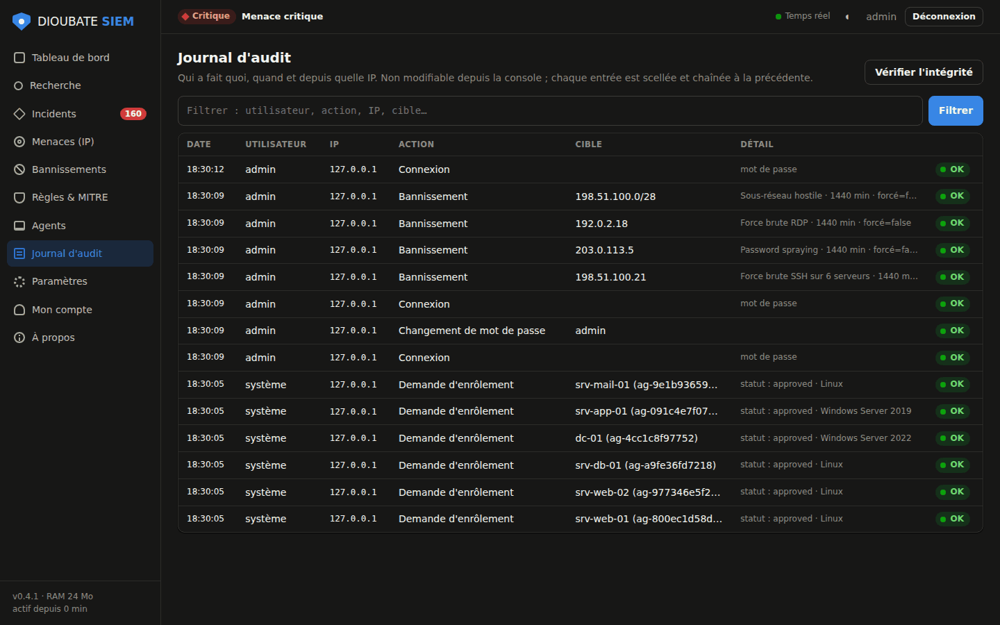 | **Paramètres**<br>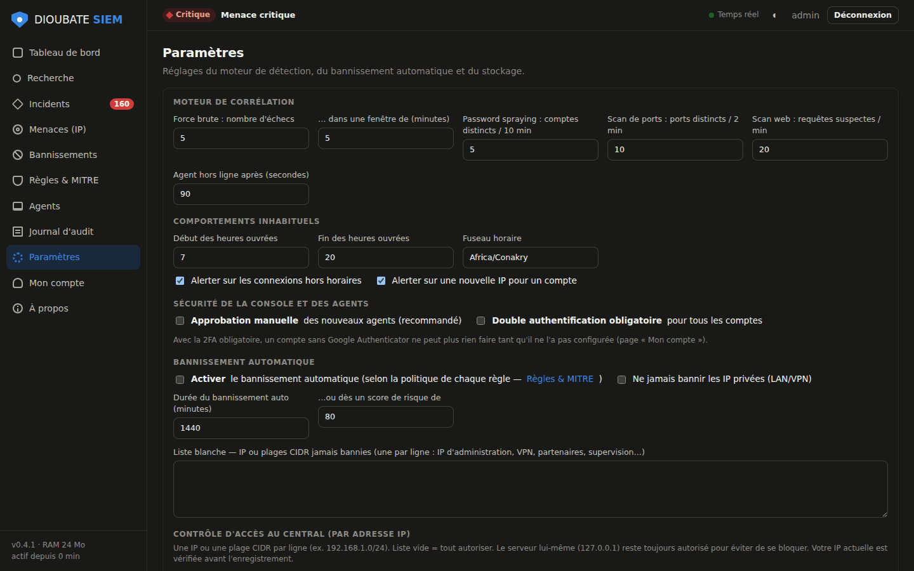 |
| **Mon compte (2FA)**<br>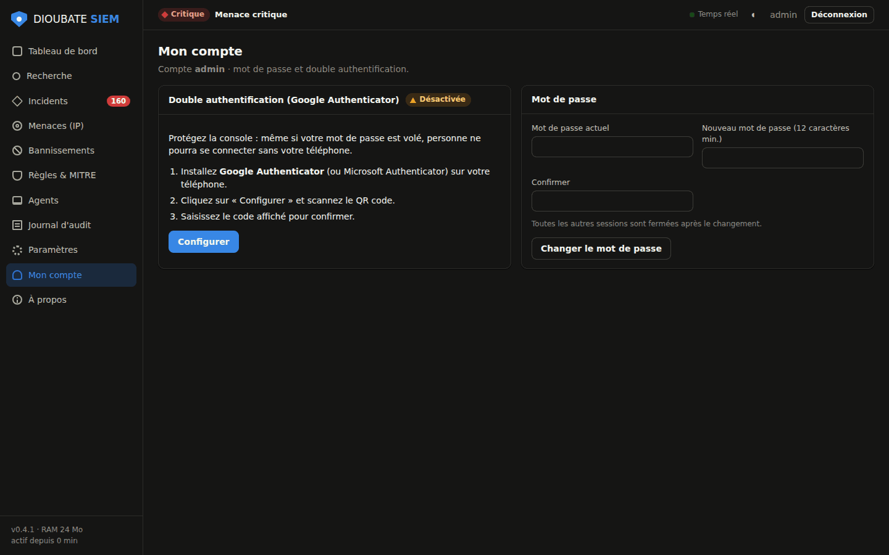 | **À propos**<br>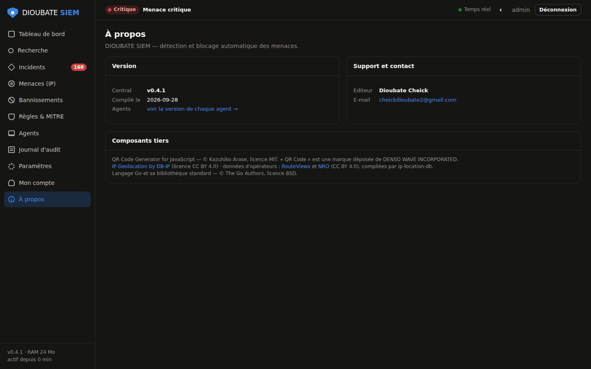 |
| **Thème clair**<br>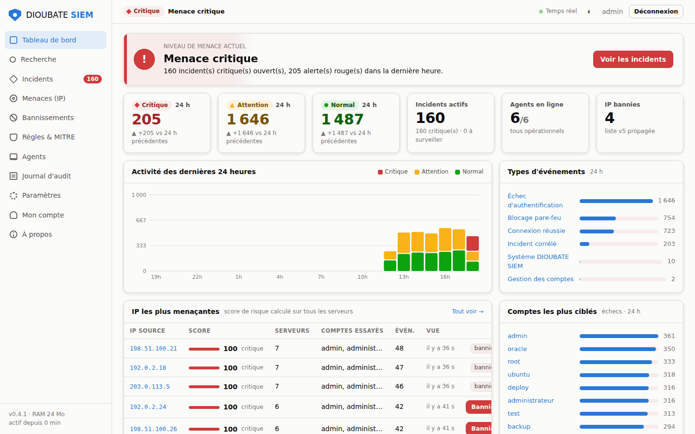 | |

## Sécurité

- TLS 1.2+ avec **épinglage** du certificat par les agents. Let's Encrypt est pris en charge pour la console.
- Double authentification TOTP, verrouillage contre la force brute, protection CSRF, en-têtes CSP et HSTS, listes blanches d'IP pour la console et pour les agents.
- **Journal d'audit chaîné et scellé** : toute modification est détectable.
- **Empreinte machine** : une clé d'agent volée puis rejouée depuis une autre machine est refusée, avec l'alerte `SYS-AGENT-CLONE`.
- **Mises à jour signées Ed25519** : la clé privée est conservée hors ligne. Un manifeste falsifié est refusé.
- Auto-protection de l'agent : service relancé s'il est arrêté, règles de pare-feu réappliquées si on les vide.

Pour signaler une vulnérabilité, voir [SECURITY.md](SECURITY.md).

## Performances mesurées

Mesures de bout en bout : un événement n'est compté que lorsqu'il est écrit sur le disque du central. Machine de test : 2 vCPU.

| Test | Résultat |
|---|---|
| 1 000 agents simultanés | ~21 000 événements/s traités et stockés, 0 perte, 390 Mo de RAM |
| 1 000 000 d'événements | 44,6 s (~22 500/s), 0 perte, ~440 Mo de RAM, 445 Mo sur disque |
| Recherche ciblée sur 1 M d'événements | 1,3 s |
| Import de 100 000 IP bannies | 305 ms |

📊 Rapport détaillé, avec 39 contrôles de sécurité : **[docs/RAPPORT-DE-TESTS.pdf](docs/RAPPORT-DE-TESTS.pdf)**

**Limites connues** : un seul central (pas de grappe) ; stockage JSONL non compressé ; recherche sans index, qui prend plusieurs secondes sur des millions de résultats ; pas encore de collecte syslog réseau ni d'agent macOS ; programmes Windows sans signature Authenticode (SmartScreen peut afficher un avertissement : vérifiez l'empreinte SHA-256).

## Configuration requise

- **Central** : Windows Server 2016 ou plus récent, ou Linux x86-64 (Ubuntu/Debian avec systemd). 1 Go de RAM minimum.
- **Agents** : Windows Server 2012 R2 ou plus récent, Windows 10/11, ou Linux x86-64.

## Licence

Gratuiciel : utilisation gratuite, y compris en entreprise, et redistribution gratuite sans modification. Voir [LICENCE.txt](LICENCE.txt) et les composants tiers dans [TIERS.txt](TIERS.txt). Logiciel fourni sans garantie.

---
© 2026 Dioubate Cheick · cheickdioubate2@gmail.com
